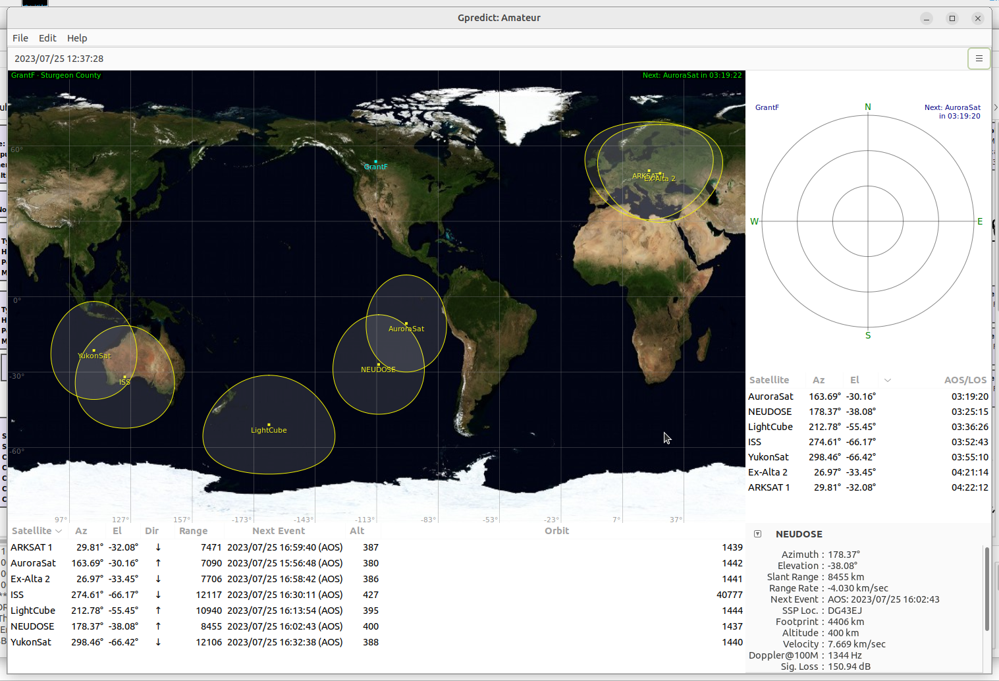
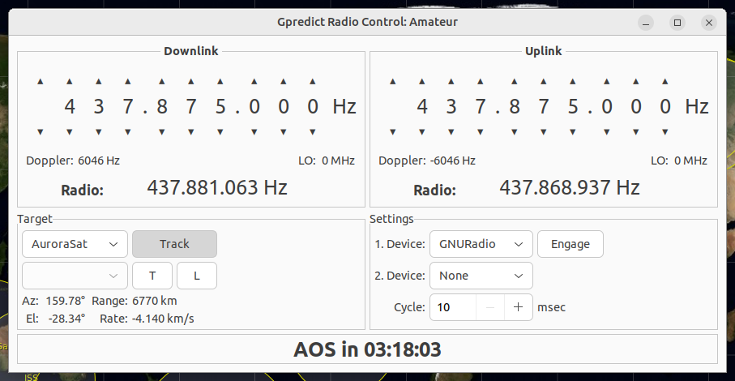
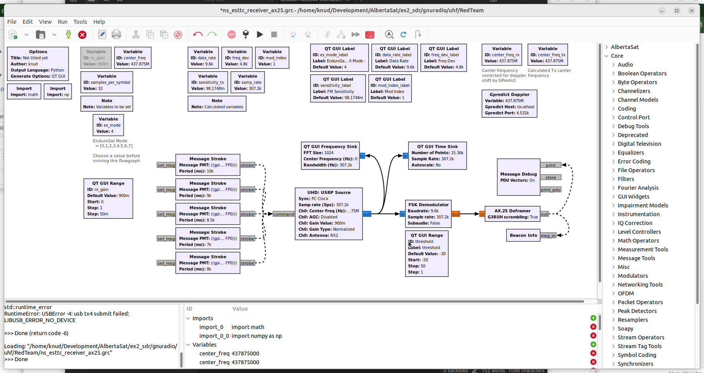
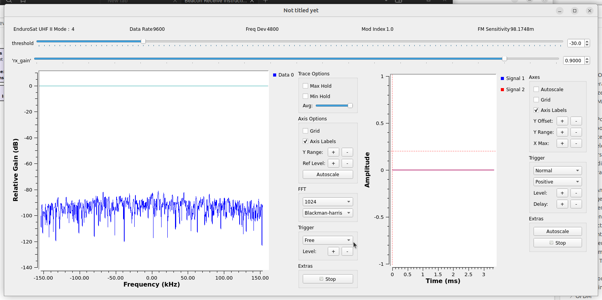
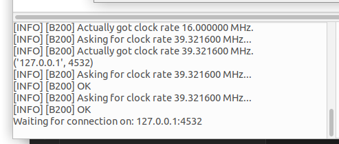
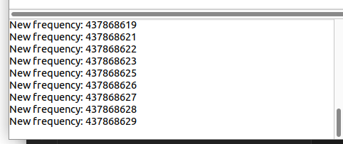
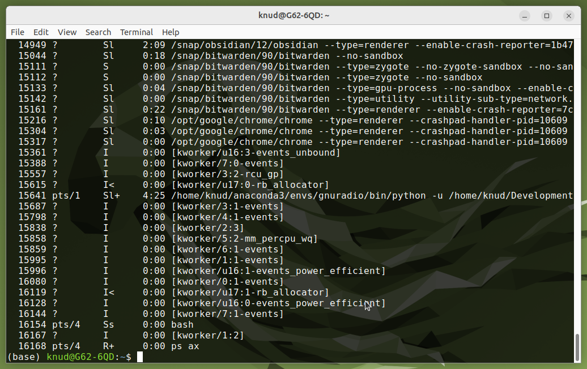

## Run GPredict to track satellites and provide Doppler correction

1. Open a terminal (shortcut is ctrl-alt-t)
2. Enter the command
   ```
   gpredict
   ```
3. GPredict will start and all the satellites of interest should be displayed.
   
	1. Under the "hamburger" menu at the top right, select "Radio Control". The GPredict Radio Control window will open. Select the satellite you want to track and set the up/down frequencies to match. 
	2. Click the "Track" button, but not "Engage", yet.
	   
	    The GNU Radio flowgraph will connect to this instance of GPredict to get real-time updates for the corrected receive frequency. The GNU Radio flowgraph uses that value directly for direct receive down-conversion to baseband, and calculates the transmit frequency for transmit up-conversion from baseband.
4. Open a second terminal (shortcut ctrl-alt-t)
5. Enter the commands
   ```
   conda activate gnuradio
   gnuradio-companion
   ```
6. This will start the GNU Radio graphical application.
7. Make sure the "GPredict Doppler" block is enabled; it is near the top right in the image below. To enable it, right-click on it and select "enable"
   
8. Run the flowgraph, but clicking the triangle start button near the top middle. The "frequency and time domain" display window shown below will appear.
   
	1. The console at the bottom left of the main GNU Radio window should show the B200mini being loaded with firmware and at the end show the application waiting to connect to GPredict as shown in the image below
	   
9. To connect, return to the GPredict program and in the control window click "Engage"
10. On the GNU Radio window console, you should see the frequency being updated
    
11. Now wait for beacons to be received. Any that are will be decoded and appear in the console. It's got a limited field of view, but you will be able to scroll back.
12. To halt GNU Radio, just dismiss the frequency and time domain display window.
	1. Unfortunately, GNURadio locks onto the GPredict socket, so you will have to kill GNURadio to start again. 
	2. Do that by dismissing the main window and waiting for Linux to ask you to kill the program.
13. If that doesn't work, then open a new terminal and enter the command
    ```
    ps ax
    ```
14. The processes running will be shown as depicted below. In this example, process number 15641 corresponds to the GNU Radio application. You can tell because the process name includes "gnuradio"
    
15. To end the process, enter the `kill -9` command with the matching process number 
    ```
    kill -9 15641
    ```
16. If you can't find the process number easily, try the following command in the terminal
    ```
    ps ax | grep gnuradio
    ```
        It will filter only those processes that have somethng to do with gnuradio, and it's safe to kill all of them (though there should be only one.)